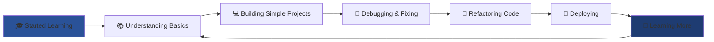

<!-- Typing SVG -->
<p align="center">
  <a href="https://git.io/typing-svg">
    
  </a>
</p>

<br/>

<!-- Profile Views & Followers -->
<p align="center">
  
  
  
</p>

---

## 👋 Hi there! Let me be real with you


I'm **Dzaki**, a Computer Engineering student at Diponegoro University in Semarang, Indonesia. 

### 🎯 The Honest Truth

- 📚 **Still learning** web development (yes, I Google things... a lot!)
- 🐛 **My code** isn't always perfect on the first try (or second... or third)
- 📖 **Reading documentation** is my daily routine
- ☕ **Stack Overflow** has saved me countless times
- 🌱 **Growing** my skills one project at a time
- 💡 **Passionate** about creating things that work (eventually!)

```yaml
name: Dzaki Amri Zaidaan
location: Semarang, Indonesia 🇮🇩
status: Computer Engineering Student
current_level: "Junior Developer (Learning Mode)"

reality_check:
  - "I don't know everything (not even close!)"
  - "I'm still figuring out best practices"
  - "My GitHub contributions are inconsistent"
  - "I learn something new every single day"
  
strengths:
  - "Willing to learn and improve"
  - "Not afraid to ask for help"
  - "Persistent when debugging"
  - "Excited about technology"

tools_i_actually_use:
  comfortable: ["HTML", "CSS", "JavaScript", "PHP", "MySQL"]
  learning: ["Laravel", "React", "Bootstrap", "Tailwind"]
  want_to_learn: ["Next.js", "TypeScript", "Docker"]
  
daily_routine:
  - "☕ Coffee"
  - "📚 Study"
  - "💻 Code (and debug... a lot)"
  - "🔍 Google & Stack Overflow"
  - "😴 Sleep (sometimes)"
```

<br clear="right"/>

---

## 🌐 Connect With Me

<p align="center">
  <a href="https://www.linkedin.com/in/dzakiamriz/" target="_blank">
    
  </a>
  <a href="https://www.instagram.com/dzakiamriz_" target="_blank">
    
  </a>
  <a href="mailto:dzakiamriz12@gmail.com" target="_blank">
    
  </a>
  <a href="https://github.com/Dzakiamriz22" target="_blank">
    
  </a>
</p>

---

## 💻 My Tech Arsenal

### ✅ What I'm Comfortable With
<p align="left">
  
</p>

### 📚 Currently Learning & Improving
<p align="left">
  
</p>

### 🛠️ Tools I Use Daily
<p align="left">
  
</p>

### 🎯 On My Learning Roadmap
<p align="left">
  
</p>

---

## 📊 GitHub Stats

<div align="center">
  
</div>

<p align="center">
  <em>Yes, my contributions are inconsistent. I'm working on it! 😅</em>
</p>

---

## 🎯 My 2025 Goals

<table align="center">
  <tr>
    <td width="50%">
      
### 💪 Technical Goals
- [ ] Complete 2-3 full-stack projects
- [ ] Contribute to 2 open source projects
- [ ] Master Laravel fundamentals
- [ ] Get comfortable with React
- [ ] Build a proper portfolio website
- [ ] Learn Git beyond basic commands
- [ ] Write cleaner, more maintainable code

    </td>
    <td width="50%">
      
### 📚 Learning Goals
- [ ] Follow 1 online course consistently
- [ ] Read technical documentation regularly
- [ ] Practice coding challenges weekly
- [ ] Build at least 1 project per month
- [ ] Learn from my mistakes (and there will be many!)
- [ ] Understand design patterns
- [ ] Improve my debugging skills

    </td>
  </tr>
</table>

---

## 💭 My Development Philosophy

> **"I don't write perfect code. I write code that works, then I make it better."**

<div align="center">

```javascript
const myJourney = {
  currentStatus: "永遠の学習者 (Eternal Learner)",
  
  mindset: {
    perfectionism: false, // Done is better than perfect
    continuous_learning: true,
    asking_for_help: "Not a weakness, it's smart!",
    making_mistakes: "Best way to learn"
  },
  
  daily_mantra: [
    "Google it first",
    "Read the docs",
    "Test before you commit",
    "Comment your code (future you will thank you)",
    "One step at a time"
  ],
  
  reality: {
    understand_everything: false,
    write_bug_free_code: false,
    know_all_frameworks: false,
    willing_to_learn: true,
    passionate: true,
    persistent: true
  }
};

console.log("Let's build something cool! 🚀");
```

</div>

---

## 🌱 What I'm Working On

<div align="center">
  
| Project Type | Status | Focus Area |
|--------------|--------|------------|
| 📱 Personal Portfolio | 🔨 In Progress | HTML, CSS, JS |
| 🛒 E-commerce Practice | 📚 Learning | Laravel |
| 🎨 UI Components | 🌱 Starting | React |
| 📝 Blog Project | 💡 Planning | Full-stack |

</div>

---

## 💡 Random Dev Wisdom

<div align="center">
  
</div>

<p align="center">
  <em>"Everyone starts somewhere. This is my somewhere." 🌟</em>
</p>

---

## 🤝 Let's Collaborate!

I'm open to:
- 🎓 **Learning together** - Fellow students or beginners
- 💻 **Small projects** - Let's build something simple but cool
- 🐛 **Code reviews** - I need feedback to grow!
- ☕ **Mentorship** - I'd love to learn from experienced developers
- 🌟 **Open source** - Baby steps into the open source world

<p align="center">
  
  
  
</p>

---

## 📈 My Learning Progress

<div align="center">



<em>It's a continuous cycle, and I'm okay with that! 🔄</em>

</div>

---

## 📫 Get In Touch

<div align="center">

**"The journey of a thousand miles begins with a single commit."** 🚀

<br/>

[](mailto:dzakiamriz12@gmail.com)
[](https://www.linkedin.com/in/dzakiamriz/)

<br/>

### 💬 Feel free to reach out!
Whether you want to discuss code, share learning resources,  
or just chat about tech - I'm all ears! 👂

</div>

---

## 🎨 Fun Facts About Me

<div align="center">

| 🎯 Fact | 📝 Details |
|---------|-----------|
| ☕ Coffee Type | "Anything with caffeine" |
| 🌙 Coding Time | Late night (bugs are scarier in the dark) |
| 🎵 Coding Music | Lo-fi beats & focus playlists |
| 🐛 Biggest Fear | Merge conflicts & production bugs |
| 😅 First Language | "Hello World" in HTML |
| 🎉 Best Feeling | When code finally works! |
| 📚 Learning Style | Tutorial hell survivor |

</div>

---

## 📊 This Week's Coding Stats

<!--START_SECTION:waka-->
<!--END_SECTION:waka-->

<p align="center">
  <em>Consistency is key, but life happens! 📅</em>
</p>

---

<div align="center">
  
  <br/>
  
  ### 🌟 Thanks for visiting my profile!
  
  <br/>
  
  
  
  
  
  <br/>
  
  **If you're a beginner like me, let's connect and grow together!** 🌱  
  **If you're experienced, I'd love to learn from you!** 🎓
      
  <br/>
  
  **© 2025 Dzaki Amri Zaidaan**  
  *"Building my future, one commit at a time"* 💙
  
  <br/><br/>
  
  
  
  <br/>
  
  <sub>⭐ Star some repos if you find anything helpful | 🍴 Fork to learn together</sub>
  
</div>
